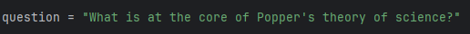
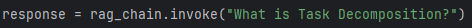
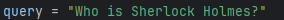

# AREP Taller 9

Este laboratorio presenta tres programas que aprovechan las bibliotecas `langchain` y `pinecone` para procesar y analizar documentos, así como para implementar 
sistemas de respuesta a preguntas (RAG) y búsqueda semántica. El primer programa muestra cómo interactuar con el modelo de lenguaje ChatGPT para enviar indicaciones 
y recuperar respuestas, utilizando la biblioteca `langchain` para el procesamiento del lenguaje. El segundo programa implementa un RAG simple usando una base de datos
vectorial en memoria, cargando documentos de un sitio web, dividiéndolos en fragmentos y utilizando un vectorstore para el almacenamiento y recuperación de documentos 
basados en sus vectores de embeddings. El tercer programa construye un RAG utilizando `Pinecone`, un servicio de búsqueda vectorial en la nube, 
para almacenar y recuperar documentos basados en la similitud de vectores de embeddings, permitiendo una búsqueda semántica utilizando GPT3 y 
Langchain. Estos programas ilustran conjuntamente la aplicación de modelos de lenguaje avanzados para generar respuestas a preguntas y la implementación 
de sistemas de respuesta a preguntas utilizando bases de datos vectoriales en memoria o servicios de búsqueda vectorial en la nube.

## Comenzando 🚀

Estas instrucciones te permitirán obtener una copia del proyecto en funcionamiento en tu máquina local para propósitos de desarrollo y pruebas.

### Pre-requisitos 📋

- [Git](https://www.youtube.com/watch?v=4xqVv2lTo40/) - Control de versiones
- [Python](https://www.python.org/downloads/) - Lenguaje de programación
- [Pip](https://pip.pypa.io/en/stable/installation/) - Sistema de gestión de paquetes

### Instalación 🔧

Para hacer una copia local del proyecto, debemos abrir nuestra terminal, dirigirnos al directorio donde estará el proyecto y usar el siguiente comando:
```
git clone https://github.com/andreaduranvivas/AREP-Taller9
```

Nos dirigimos al directorio creado con

```
cd AREP-Taller9
```

Instalamos las dependencias necesarias con el siguiente comando

```
pip install -r resources/requirements.txt
```

### Ejecutando la aplicación

#### Programa 1: Enviar indicaciones a ChatGPT y recuperar respuestas

Este programa utiliza Python para interactuar con el modelo de lenguaje de ChatGPT, enviando indicaciones y recuperando respuestas. Se configura con una clave API de OpenAI y utiliza la biblioteca 
`langchain` para definir y ejecutar la cadena de procesamiento de lenguaje. Este programa se puede ejecutar desde la línea de comandos con el siguiente comando:

```python
python programs/chat.py
```

#### Programa 2:  Crear un RAG simple usando una base de datos vectorial en memoria

Este programa implementa un sistema de respuesta a preguntas (RAG) utilizando una base de datos vectorial en memoria. Carga documentos de un sitio web, los divide en fragmentos, y utiliza un vectorstore
para almacenar y recuperar documentos basados en sus vectores de embeddings. Luego, utiliza un modelo de chat para responder preguntas basadas en el contexto recuperado. Este programa se puede ejecutar 
desde la línea de comandos con el siguiente comando:

```python
python programs/rag.py
```

#### Programa 3: Crear un RAG usando Pinecone

Este programa demuestra cómo construir un sistema de respuesta a preguntas (RAG) utilizando Pinecone, un servicio de búsqueda vectorial en la nube. Se cargan documentos de texto, se dividen en fragmentos, y se almacenan
en Pinecone para permitir búsquedas basadas en similitud de vectores de embeddings. Luego, se realiza una búsqueda de similitud para encontrar documentos relevantes a una consulta dada. Este programa se puede ejecutar 
desde la línea de comandos con el siguiente comando:

```python
python programs/pinecone.py
```


## Ejecutando las pruebas ⚙️

#### Programa 1: Enviar indicaciones a ChatGPT y recuperar respuestas

La pregunta que está por defecto es: "What is at the core of Popper's theory of science?" y la respuesta es la siguiente:



Podemos cambiar la pregunta que queremos hacerle al chatbot, para ello debemos modificar la variable `question` en el archivo `chat.py` y luego ejecutar el programa.


#### Programa 2:  Crear un RAG simple usando una base de datos vectorial en memoria

La pregunta que está por defecto es: "What is Task Decomposition?", y la respuesta es la siguiente:



Podemos cambiar la pregunta que queremos hacerle al chatbot, para ello debemos modificar el parámetro de en el archivo `rag.py` y luego ejecutar el programa.

#### Programa 3: Crear un RAG usando Pinecone

En este caso, las preguntas las vamos haciendo nosotros mismos, y el programa nos devuelve la respuesta que más se asemeje 
a la pregunta que hicimos. Para ello, tenemos un archivo de texto llamado `Conocimiento.txt` que una historia de Sherlock Holmes, llamada "The Adventure of the Empty House",
este archivo es el que se carga en la base de datos de Pinecone. Luego, podemos hacer preguntas como: "Who is Sherlock Holmes?" y el programa nos devolverá la respuesta más cercana 
a la pregunta que hicimos.

En la siguiente imagen podemos ver un ejemplo de una pregunta que hicimos al programa y la respuesta que nos devolvió:




## Construido con 🛠️

* [Python](https://www.java.com/es/) - Lenguaje de programación
* [ChatGPT](https://maven.apache.org/) - Aplicación de chatbot de inteligencia artificial
* [Pinecone](https://www.pinecone.io/) - Base de datos vectorial en la nube impulsada por IA


## Documentación 📖

Para visualizar la documentación del proyecto solo debes ingresar la función help() en la consola de python y luego
el nombre del módulo que deseas consultar. Por ejemplo:

```python
help(loadText)
```

## Versionado 📌


## Autores ✒️

* **Andrea Johana Durán Vivas** - [andreaduranvivas](https://github.com/andreaduranvivas)

## Licencia 📄

Este proyecto está bajo la Licencia MIT - mira el archivo [LICENSE](LICENSE) para detalles

## Agradecimientos 🎁

- Al profesor [Luis Daniel Benavides Navarro](https://ldbn.is.escuelaing.edu.co/)

